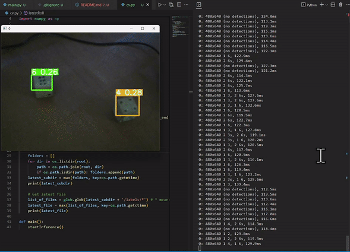

# Enquiry into augmenting the social lives of the elderly using Games

Adhavan, 3-03-2022

Disclaimer: This project has been continued from work in 2022, please refer to commit history at the github repository. The first prototype was made in JS, this is being attempted in python.

**Github (js version): https://github.com/rungdung/game-aids-for-the-elderly**

## Concept notes
### Focus on hybrid game environments
- Look at how games are played today, in the past and during Covid. How did games allow people to interface with each other? 
- How do older people adapt to these game play situations?
- How does memory retention affect Interface design?

### Possibilities 
To envision a series of explorations into ML based aids for game accessibility. Along the **lines of physical, visual and audio aids.** 
- Envisioning **it as a Social Media with an analogue interface for the digitally illiterate**. 
- Understanding and designing inclusively for multiple, entrenched disabilities. 



## Run instructions
- For Dice detection run the  file
- For the UI demo of the game run the  file

## Issues
- The dice detection is not very accurate, the model needs to be retrained with more data.
- ```model.predict``` is not working as expected, I am unable to extract the predictions from ```probs``` attribute, it returns none
- However it is possible to write the predictions to a file, and read it back in the main file. This has not been implemented yet, this is a workaround.

## Technical roadmap
- Developing proof of concept prototypes for voice and visual aids. Think voice commands, pose recognition natural language processing, etc.
  - [x] Object detection for dice and pieces. Refer to the  notebook for the training process. This was trained on Google Collab
- Multiplayer User interfaces
  - [x] Code cloned from Jay Polra's work on multiplayer snakes and ladders on python
- [ ] Integration with Object detection and roll dice on the UI 

**Access the js proof of concept UI here**:
https://editor.p5js.org/adhavan.sivaraj16/sketches/gYqQM01IU


